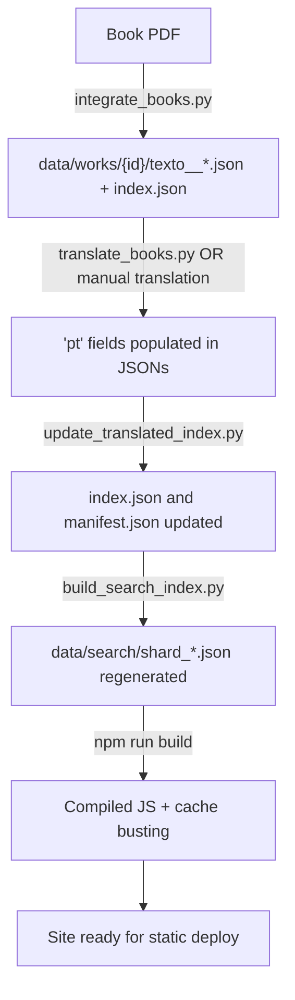

# Complete Project Documentation: Trilingual Abhidhamma Piṭaka

## Overview

Static single-page web application (SPA), backend-free, presenting the complete **Abhidhamma Piṭaka** in parallel Pāli / English / Portuguese / Spanish, along with classical treatises and contemporary commentaries.

> [!IMPORTANT]
> **Tech stack:** TypeScript (compiled to JS) + Python 3 (data scripts). **NO Node.js runtime on the server** — Node.js is only used to compile TypeScript via `tsc`.

---

## Directory Structure

```
abhidhamma-pitaka-trilingue-site/
├── index.html              ← Main SPA (single page)
├── package.json            ← npm scripts (build, watch, integrate-books, rebuild-search)
├── tsconfig.json           ← TypeScript configuration (ES2022, strict)
├── .env                    ← GEMINI_API_KEY for automated translation
├── .nojekyll               ← Flag for GitHub Pages
│
├── src/                    ← TypeScript source code
│   ├── app.ts              ← Main controller, router, bootstrap
│   ├── reader.ts           ← Segment rendering in reader
│   ├── dictionary.ts       ← Pāli dictionary with lookup
│   ├── search.ts           ← Full-text corpus search
│   ├── export.ts           ← Client-side PDF/EPUB generator
│   ├── selection.ts        ← Bidirectional selection and popover
│   ├── tree.ts             ← Navigation tree
│   ├── state.ts            ← State management (localStorage)
│   ├── i18n.ts             ← UI internationalization
│   ├── types.ts            ← TypeScript types and interfaces
│   └── logger.ts           ← Logger
│
├── js/                     ← Compiled JS (tsc output) + source maps
│   ├── app.js, reader.js, dictionary.js, search.js, ...
│   └── *.js.map
│
├── css/
│   └── style.css           ← Single stylesheet (14.5 KB)
│
├── img/
│   └── logo.png            ← Project logo
│
├── scripts/                ← Python data processing scripts
│   ├── integrate_books.py  ← PDF extraction → JSON + chunking + manifest
│   ├── translate_books.py  ← EN→PT translation via Gemini API
│   ├── build_search_index.py ← Sharded search index generator
│   ├── version_js.py       ← Cache buster (MD5 hashes in imports)
│   ├── update_translated_index.py ← Sync TOC/manifest after translation
│   ├── clean_html.py       ← Remove HTML tags from translations
│   ├── extract_data.py     ← Extract canonical texts from SQLite
│   ├── build_core_dictionary.py
│   ├── build_common_dictionary.py
│   └── extracted/          ← Intermediate extraction cache
│
├── data/
│   ├── manifest.json       ← Global manifest (1.3 MB) — work hierarchy
│   ├── works/              ← 18 work directories
│   │   ├── dhammasangani/  ← Canonical (mula__0.json, attha__0.json, etc.)
│   │   ├── buddhism-in-daily-life/  ← Commentary (texto__0..18.json)
│   │   ├── path-without-ownership/  ← Commentary (texto.json, texto__1.json)
│   │   └── ...
│   ├── dictionary/
│   │   ├── pali_core.json      ← 721 Pāli lemmas (711 KB)
│   │   └── common_pali.json    ← 182 common entries (42 KB)
│   └── search/
│       ├── manifest.json       ← Shard map
│       └── shard_*.json        ← ~50 inverted index files
│
├── docs/                   ← Architectural documentation
│   ├── 01_architecture.md
│   ├── 02_corpus_data.md
│   ├── 03_frontend_modules.md
│   ├── 04_build_pipeline.md
│   ├── 05_philological_corrections.md
│   ├── 06_export_module.md
│   ├── 07_open_issues.md
│   └── MASTER_LOG.md
│
└── *.pdf                   ← Source PDFs for contemporary books
```

---

## Available npm Commands

| Command | What it does |
|---|---|
| `npm run build` | `tsc && python3 scripts/version_js.py` — Compiles TS→JS and applies cache busting |
| `npm run watch` | `tsc --watch` — Recompiles automatically when editing `.ts` |
| `npm run integrate-books` | `python3 scripts/integrate_books.py` — Extracts PDFs, generates chunks, and updates manifest |
| `npm run rebuild-search` | `python3 scripts/build_search_index.py` — Rebuilds search index |

---

## Critical Python Scripts

### 1. `scripts/integrate_books.py` — PDF Extraction Pipeline
- Extracts text from the 6 contemporary commentary PDFs
- Cleans headers, footers, page numbers, ISBN
- Classifies paragraphs into `rend` types: `book`, `chapter`, `subhead`, `bodytext`
- Generates JSON segments structured as: `{id, rend, paranum, pali, pt, en, es}`
- **Chunking:** splits into files of ~900 segments (`texto__0.json`, `texto__1.json`, etc.)
- Generates `index.json` per work and updates `data/manifest.json`

### 2. `scripts/translate_books.py` — EN→PT Translation via Gemini
- Usage: `python3 scripts/translate_books.py <book-id>`
- Reads `GEMINI_API_KEY` from `.env`
- Enforces strict philological rules (dhamma≠phenomenon, kamma≠karma)
- Checkpoints every 20 segments
- Model cascade: gemini-3.1-pro → 2.5-pro → 3.7-flash → 3.6-flash → 3.5-flash

### 3. `scripts/update_translated_index.py` — Post-Translation Synchronization
- Reads translated chunks (`texto__*.json`)
- Recalculates TOC, segment count, and `chunkStarts`
- Updates work's `index.json` and `manifest.json`

### 4. `scripts/version_js.py` — Cache Buster
- Computes MD5 hash for all `.js` files
- Rewrites imports (`from "./reader.js"` → `from "./reader.js?v=8374a72b"`)
- Updates `<script>` and `<link>` tags in `index.html`

### 5. `scripts/build_search_index.py` — Search Index
- Iterates over all works in the manifest
- Tokenizes text (Pāli, EN, PT, ES)
- Generates shards by initial letter (50 files)

---

## Data Structures

### Segment (`Segment`)
```json
{
  "id": 42,
  "rend": "bodytext",        // "book" | "chapter" | "subhead" | "bodytext"
  "paranum": null,
  "pali": "Texto original",  // For commentaries: ENGLISH is stored here
  "pt": "Tradução PT",
  "en": "",
  "es": ""
}
```

### Manifest (`manifest.json`) — Groups
| Group | Contents |
|---|---|
| `"abhidhamma"` | 7 canonical books (Dhammasaṅgaṇī, Vibhaṅga, etc.) |
| `"outros"` | Post-canonical treatises (Abhidhammāvatāra, etc.) |
| `"visuddhimagga"` | Visuddhimagga (mūla, ṭīkā, nidānakathā) |
| `"comentarios"` | 7 contemporary books (Nina van Gorkom, Rob Kirkpatrick) |

### Work in Manifest
```json
{
  "id": "buddhism-in-daily-life",
  "title": "Buddhism in Daily Life",
  "parts": {
    "texto": {
      "label": "Texto",
      "files": ["texto__0.json", "texto__1.json", ...],
      "toc": [{"id": 4, "rend": "chapter", "text": "Preface"}, ...],
      "chunkStarts": [1, 901, 1801],
      "count": 2700
    }
  }
}
```

---

## Full Workflow Pipeline



---

## Absolute Philological Rules

> [!CAUTION]
> - **NEVER** translate `dhamma` as "phenomenon" → use "reality" or keep `dhamma`
> - **NEVER** use "karma" → always `kamma`
> - **NEVER** translate "wholesome" as "skillful" ("habilidoso") → use "wholesome" / "salutar" / "benéfico"
> - Preserve technical Pāli terms: `citta`, `cetasika`, `rūpa`, `nibbāna`, `jhāna`, `khandha`, `kusala`, `akusala`, `lobha`, `dosa`, `moha`, `sati`, `paññā`, etc.
> - No HTML tags (`<b>`, `<i>`, `<sup>`, `<br>`) in `pt` fields

---

## Operational Constraints

> [!WARNING]
> - **Deploy:** Manual upload of the folder to GitHub — **NEVER automated git commit/push**
> - **Hosting:** 100% static site, no backend/server
> - **Terminal:** `run_command` blocked by hook in this agent environment
