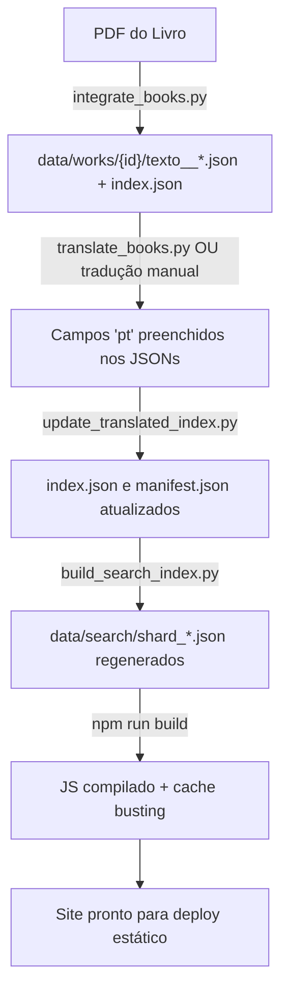

# Documentação Completa do Projeto: Abhidhamma Piṭaka Trilíngue

## Visão Geral

Aplicação web **estática** (SPA) de página única, sem backend, que apresenta o **Abhidhamma Piṭaka** completo em paralelo Pāli / Inglês / Português / Espanhol, juntamente com tratados clássicos e comentários contemporâneos.

> [!IMPORTANT]
> **Stack tecnológico:** TypeScript (compilado para JS) + Python 3 (scripts de dados). **NÃO há Node.js runtime no servidor** — Node.js é usado apenas para compilar TypeScript via `tsc`.

---

## Estrutura de Diretórios

```
abhidhamma-pitaka-trilingue-site/
├── index.html              ← SPA principal (página única)
├── package.json            ← Scripts npm (build, watch, integrate-books, rebuild-search)
├── tsconfig.json           ← Configuração TypeScript (ES2022, strict)
├── .env                    ← GEMINI_API_KEY para tradução automática
├── .nojekyll               ← Flag para GitHub Pages
│
├── src/                    ← Código-fonte TypeScript
│   ├── app.ts              ← Controlador principal, router, bootstrap
│   ├── reader.ts           ← Renderização de segmentos no leitor
│   ├── dictionary.ts       ← Dicionário Pāli com lookup
│   ├── search.ts           ← Busca full-text no corpus
│   ├── export.ts           ← Gerador PDF/EPUB client-side
│   ├── selection.ts        ← Seleção bidirecional e popover
│   ├── tree.ts             ← Árvore de navegação
│   ├── state.ts            ← Gestão de estado (localStorage)
│   ├── i18n.ts             ← Internacionalização da UI
│   ├── types.ts            ← Tipos e interfaces TypeScript
│   └── logger.ts           ← Logger
│
├── js/                     ← JS compilado (output do tsc) + source maps
│   ├── app.js, reader.js, dictionary.js, search.js, ...
│   └── *.js.map
│
├── css/
│   └── style.css           ← Stylesheet único (14.5 KB)
│
├── img/
│   └── logo.png            ← Logo do projeto
│
├── scripts/                ← Scripts Python de processamento de dados
│   ├── integrate_books.py  ← Extração PDF → JSON + chunking + manifest
│   ├── translate_books.py  ← Tradução EN→PT via Gemini API
│   ├── build_search_index.py ← Gerador de índice de busca sharded
│   ├── version_js.py       ← Cache buster (hashes MD5 nos imports)
│   ├── update_translated_index.py ← Sincroniza TOC/manifest após tradução
│   ├── clean_html.py       ← Remove tags HTML das traduções
│   ├── extract_data.py     ← Extrai textos canónicos de SQLite
│   ├── build_core_dictionary.py
│   ├── build_common_dictionary.py
│   └── extracted/          ← Cache de extração intermediária
│
├── data/
│   ├── manifest.json       ← Manifesto global (1.3 MB) — hierarquia de obras
│   ├── works/              ← 18 diretórios de obras
│   │   ├── dhammasangani/  ← Canónico (mula__0.json, attha__0.json, etc.)
│   │   ├── buddhism-in-daily-life/  ← Comentário (texto__0..18.json)
│   │   ├── path-without-ownership/  ← Comentário (texto.json, texto__1.json)
│   │   └── ...
│   ├── dictionary/
│   │   ├── pali_core.json      ← 721 lemas Pāli (711 KB)
│   │   └── common_pali.json    ← 182 entradas comuns (42 KB)
│   └── search/
│       ├── manifest.json       ← Mapa de shards
│       └── shard_*.json        ← ~50 ficheiros de índice invertido
│
├── docs/                   ← Documentação arquitetural
│   ├── 01_architecture.md
│   ├── 02_corpus_data.md
│   ├── 03_frontend_modules.md
│   ├── 04_build_pipeline.md
│   ├── 05_philological_corrections.md
│   ├── 06_export_module.md
│   ├── 07_open_issues.md
│   └── MASTER_LOG.md
│
└── *.pdf                   ← PDFs fonte dos livros contemporâneos
```

---

## Comandos npm Disponíveis

| Comando | O que faz |
|---|---|
| `npm run build` | `tsc && python3 scripts/version_js.py` — Compila TS→JS e aplica cache busting |
| `npm run watch` | `tsc --watch` — Recompila automaticamente ao editar `.ts` |
| `npm run integrate-books` | `python3 scripts/integrate_books.py` — Extrai PDFs, gera chunks e atualiza manifest |
| `npm run rebuild-search` | `python3 scripts/build_search_index.py` — Reconstrói índice de busca |

---

## Scripts Python Críticos

### 1. `scripts/integrate_books.py` — Pipeline de Extração de PDFs
- Extrai texto dos 6 PDFs de comentários contemporâneos
- Limpa headers, footers, números de página, ISBN
- Classifica parágrafos em tipos `rend`: `book`, `chapter`, `subhead`, `bodytext`
- Gera segmentos JSON com estrutura: `{id, rend, paranum, pali, pt, en, es}`
- **Chunking:** divide em ficheiros de ~900 segmentos (`texto__0.json`, `texto__1.json`, etc.)
- Gera `index.json` por obra e atualiza `data/manifest.json`

### 2. `scripts/translate_books.py` — Tradução EN→PT via Gemini
- Uso: `python3 scripts/translate_books.py <book-id>`
- Lê `GEMINI_API_KEY` do `.env`
- Aplica regras filológicas rigorosas (dhamma≠fenômeno, kamma≠karma)
- Checkpoints a cada 20 segmentos
- Cascade de modelos: gemini-3.1-pro → 2.5-pro → 3.7-flash → 3.6-flash → 3.5-flash

### 3. `scripts/update_translated_index.py` — Sincronização pós-tradução
- Lê os chunks traduzidos (`texto__*.json`)
- Recalcula TOC, contagem de segmentos e `chunkStarts`
- Atualiza `index.json` da obra e `manifest.json`

### 4. `scripts/version_js.py` — Cache Buster
- Calcula hash MD5 de todos os `.js`
- Reescreve imports (`from "./reader.js"` → `from "./reader.js?v=8374a72b"`)
- Atualiza `<script>` e `<link>` no `index.html`

### 5. `scripts/build_search_index.py` — Índice de Busca
- Itera todas as obras no manifest
- Tokeniza texto (Pāli, EN, PT, ES)
- Gera shards por letra inicial (50 ficheiros)

---

## Estrutura de Dados

### Segmento (`Segment`)
```json
{
  "id": 42,
  "rend": "bodytext",        // "book" | "chapter" | "subhead" | "bodytext"
  "paranum": null,
  "pali": "Texto original",  // Para comentários: armazena o INGLÊS aqui
  "pt": "Tradução PT",
  "en": "",
  "es": ""
}
```

### Manifesto (`manifest.json`) — Grupos
| Grupo | Conteúdo |
|---|---|
| `"abhidhamma"` | 7 livros canónicos (Dhammasaṅgaṇī, Vibhaṅga, etc.) |
| `"outros"` | Tratados pós-canónicos (Abhidhammāvatāra, etc.) |
| `"visuddhimagga"` | Visuddhimagga (mūla, ṭīkā, nidānakathā) |
| `"comentarios"` | 7 livros contemporâneos (Nina van Gorkom, Rob Kirkpatrick) |

### Obra no Manifesto
```json
{
  "id": "buddhism-in-daily-life",
  "title": "Buddhism in Daily Life",
  "parts": {
    "texto": {
      "label": "Texto",
      "files": ["texto__0.json", "texto__1.json", ...],
      "toc": [{"id": 4, "rend": "chapter", "text": "Preface"}, ...],
      "chunkStarts": [1, 901, 1801],
      "count": 2700
    }
  }
}
```

---

## Pipeline Completo de Trabalho



---

## Regras Filológicas Absolutas

> [!CAUTION]
> - **NUNCA** traduzir `dhamma` como "fenômeno" → usar "realidade" ou manter `dhamma`
> - **NUNCA** usar "karma" → sempre `kamma`
> - **NUNCA** traduzir "wholesome" como "habilidoso" → usar "salutar" / "benéfico"
> - Manter termos Pāli técnicos: `citta`, `cetasika`, `rūpa`, `nibbāna`, `jhāna`, `khandha`, `kusala`, `akusala`, `lobha`, `dosa`, `moha`, `sati`, `paññā`, etc.
> - Sem tags HTML (`<b>`, `<i>`, `<sup>`, `<br>`) nos campos `pt`

---

## Restrições Operacionais

> [!WARNING]
> - **Deploy:** Upload manual da pasta para GitHub — **NUNCA git commit/push automático**
> - **Hosting:** Site 100% estático, sem backend/servidor
> - **Terminal:** `run_command` bloqueado por hook neste ambiente de agente
